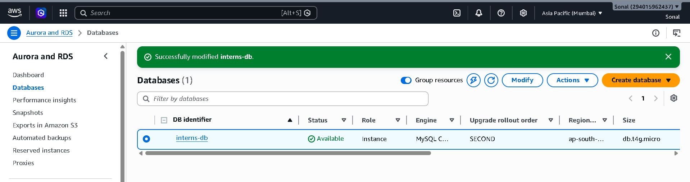
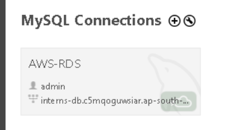
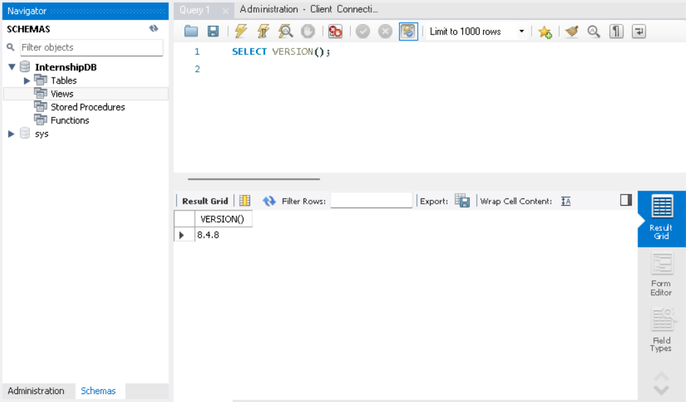
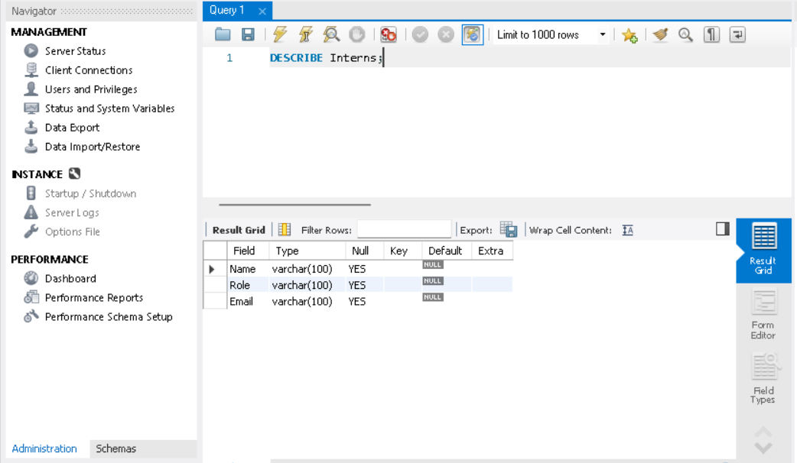
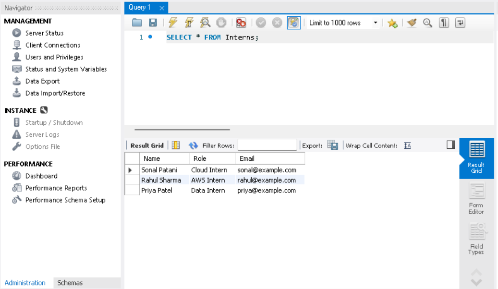
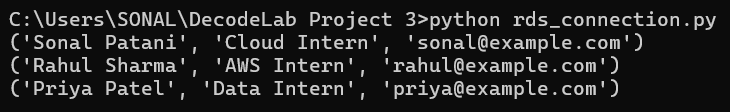

# AWS RDS Cloud Database System ☁️

## Project Overview

An e-commerce company was managing customer data using Excel sheets. 
This project focuses on building a scalable and secure cloud database solution using **AWS RDS MySQL**.

The goal was to deploy a managed relational database system to store and manage records reliably.

---

## Objectives

- Setup a managed cloud database using AWS RDS
- Create a relational database and table
- Store and retrieve records using SQL
- Connect the cloud database using MySQL Workbench
- Connect the database using Python

---

## Technologies Used

- AWS RDS (MySQL)
- MySQL Workbench
- SQL
- Python
- MySQL Connector

---

## Database Details

**Database Name: InternshipDB**

**Table Name: Interns**

### Table Structure

| Column | Data Type |
|---|---|
| Name | VARCHAR(100) |
| Role | VARCHAR(100) |
| Email | VARCHAR(100) |

---

## Sample Records

| Name | Role | Email |
|---|---|---|
| Sonal Patani | Cloud Intern | sonal@example.com |
| Rahul Sharma | AWS Intern | rahul@example.com |
| Priya Patel | Data Intern | priya@example.com |

---

## SQL Operations Performed

### Create Database

```sql
CREATE DATABASE InternshipDB;

CREATE TABLE Interns (
    Name VARCHAR(100),
    Role VARCHAR(100),
    Email VARCHAR(100)
);

INSERT INTO Interns (Name, Role, Email)
VALUES
('Sonal Patani', 'Cloud Intern', 'sonal@example.com'),
('Rahul Sharma', 'AWS Intern', 'rahul@example.com'),
('Priya Patel', 'Data Intern', 'priya@example.com');

SELECT * FROM Interns;


## Project Screenshots

### 1. AWS RDS MySQL Database Setup

AWS RDS instance successfully created and configured.



---

### 2. MySQL Workbench Connection

Successfully connected AWS RDS MySQL database with MySQL Workbench.



---

### 3. Database Creation

Created `InternshipDB` database using SQL query.



---

### 4. Table Creation

Created `Interns` table with Name, Role, and Email columns.



---

### 5. Data Insertion and Retrieval

Inserted dummy records and verified data persistence.



---

### 6. Python Database Connection

Connected AWS RDS MySQL database using Python and retrieved records.




## Author

**Sonal Patani**

Cloud & Database Enthusiast | Learning AWS, Python, and Cloud Technologies
